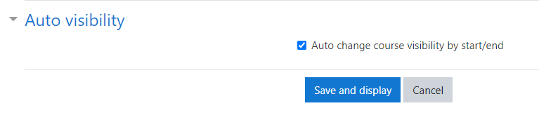

# Course auto visibility change #

If you install this plugin, you have a new configuration item in course page, where you can 
enable auto show/hide feature. The scheduled task based on course start date / end date change the 
course status from hide to show or show to hide.

Supported Moodle version: 3.9.x

## License ##

2020 Szabolcs Várhegyi <sz.varhegyi@gmail.com>

This program is free software: you can redistribute it and/or modify it under
the terms of the GNU General Public License as published by the Free Software
Foundation, either version 3 of the License, or (at your option) any later
version.

This program is distributed in the hope that it will be useful, but WITHOUT ANY
WARRANTY; without even the implied warranty of MERCHANTABILITY or FITNESS FOR A
PARTICULAR PURPOSE.  See the GNU General Public License for more details.

You should have received a copy of the GNU General Public License along with
this program.  If not, see <http://www.gnu.org/licenses/>.
